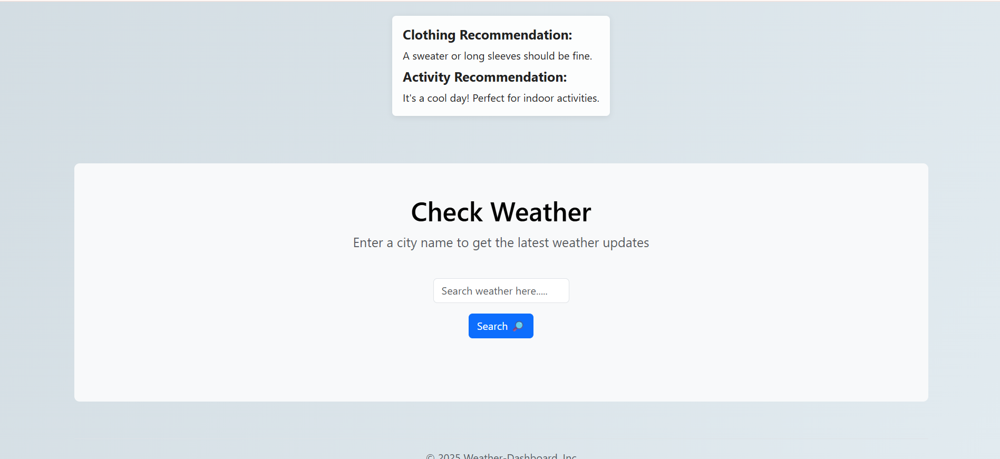

# Weather Wise

Weather Wise is your intelligent weather assistant that provides real-time weather forecasts, clothing, and activity recommendations using modern UI and dynamic backgrounds. Empower users with fast, accurate, and visually appealing weather insights.

---

---

##  Features

- 🌦️ Real-time weather information for any city
- 📅 7-day weather forecast with details (humidity, wind, sunrise/sunset, precipitation)
- 🎨 Dynamic, beautiful backgrounds and weather icons based on actual weather conditions and time (day/night)
- 👕 Clothing and activity recommendations tailored to the weather
- 📱 Fully responsive design for mobile, tablet, and desktop
- ♿ Accessible UI with good color contrast, ARIA labels, and keyboard navigation
- ⚠️ Error handling for invalid city names or API issues

---

##  Technology

- Django (Python)
- Bootstrap (CSS Framework)
- Open-Meteo API (Weather Data)
- Google Geocoding API
- JavaScript (AJAX, jQuery)
- HTML5, CSS3

---

##  Example Output

- 🌡️ Entered "London" → Shows current weather, 7-day forecast, and what to wear
- 👕 "It's 8°C" → Recommends a jacket and indoor activities
- ☀️ "It's 28°C" → Suggests light clothing and outdoor fun

---

##  Why Weather Wise?

Many weather apps are cluttered or hard to read. Weather Wise bridges the gap with a clean, modern interface, actionable recommendations, and accessibility for all users.

---

##  Contribute / Collaborate

Pull requests welcome! Reach out on [LinkedIn](https://www.linkedin.com/) or open an issue.

---
